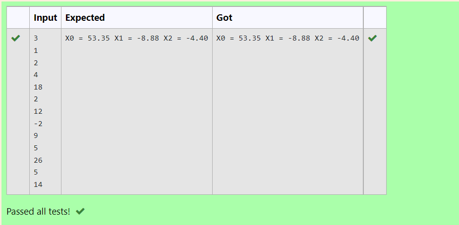

# Gaussian Elimination

## AIM:
To write a program to find the solution of a matrix using Gaussian Elimination.

## Equipments Required:
1. Hardware – PCs
2. Anaconda – Python 3.7 Installation / Moodle-Code Runner

## Algorithm
1. Import a python library called numpy and use np as it's shortened form.
2. Import sys(system-specific parameters and function).
3. Create a numpy array ‘a’ of size nx(n+1) and initialized it to zero. We will be storing our augmented matrix in this array.
4. Another array ‘x’ of size n is also created and initialized to zero. We will use this array to store the solution vector.
5. Use nested for loop to get the input of the augmented matrix.
6. Apply the Gaussian elimination method.
7. If any of the coefficients is 0, an error is raised as division by zero is not possible.
8. Apply the back substitution method to obtain the desired output. 

## Program:
```
'''Program to solve a matrix using Gaussian elimination with partial pivoting.
Developed by: Sowmiya N
RegisterNumber: 21500134
'''
import numpy as np
import sys
n = int(input())
a = np.zeros((n,n+1))
x = np.zeros(n)
for i in range(n):
    for j in range(n+1):
        a[i][j] = float(input())
for i in range(n):
    if a[i][i] == 0.0:
        sys.exit("Divide by zero detected!")
    for j in range(i+1,n):
        ratio=a[j][i]/a[i][i]
        for k in range(n+1):
            a[j][k] = a[j][k] - ratio * a[i][k]
x[n-1] = a[n-1][n]/a[n-1][n-1]
for i in range(n-2,-1,-1):
    x[i] = a[i][n]
    for j in range(i+1,n):
        x[i] = x[i] - a[i][j]*x[j]
    x[i] = x[i]/a[i][i]
for i in range(n):
    print("X%d = %0.2f" %(i,x[i]), end = " ")
    
```

## Output:



## Result:
Thus the program to find the solution of a matrix using Gaussian Elimination is written and verified using python programming.

